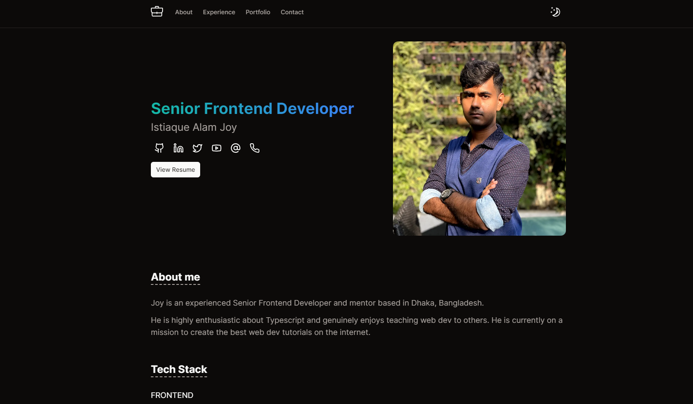

# Nextjs + Sanity Personal Portfolio Template

## Featurs

* User Content Dashboard with Authentication
* Work Experience Timeline view
* Project Grid / List view
* Dark/light mode

## Version 0.2.0 upcoming features

* ✅ Modal Card for projects
* ✅ add animations - framer motion
* ✅ add animations on project component
* ✅ add option for projects to be shown as a list or grid view
* ✅ mouse pointer event -> animated cursors
* ✅ loading screen
* ✅ update dayjs on the timeline view
* ✅ Fix Seo of the project page
* ✅ adjust height of the modal depending on the amount of words

## Design Inspirations and Credits

* [Design Inspiration -> zwel.dev](https://github.com/zwelhtetyan/zwel.dev)
* [Component Library -> shadcn ui](https://ui.shadcn.com/)
* [Dashboard -> Sanity](https://www.sanity.io/)
* [Design Inspiration atiqurrahaman](https://www.atiqurrahaman.com/)
* [design inspiration](https://yao-it-firm.vercel.app/)

## Nice Resources

* [Word count and reading time estimation for GROQ and Portable Text](https://www.sanity.io/schemas/word-count-and-reading-time-estimation-for-groq-and-portable-text-7470eab7)
